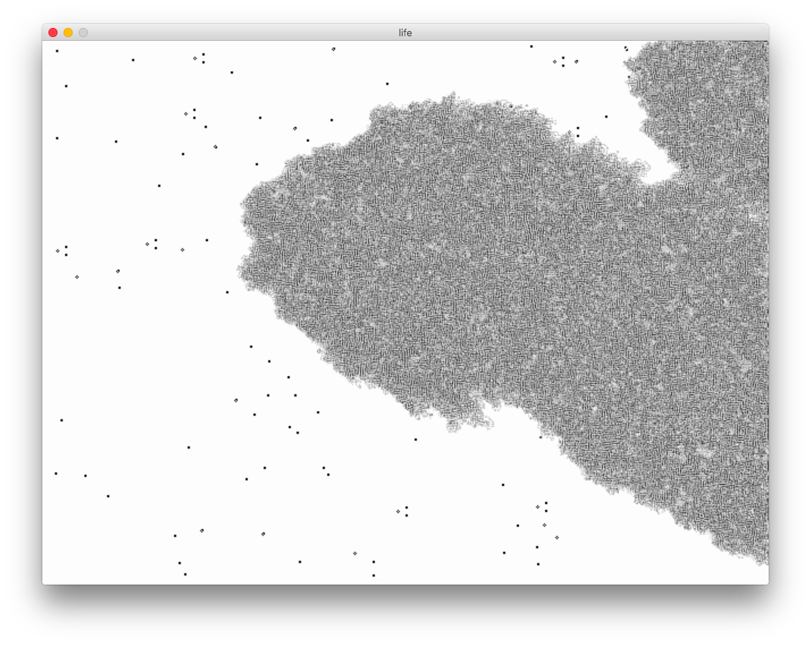

# Processing Sketches

### What is Processing?
[Processing](www.processing.org) is a language paired with an IDE which provides a fun and easy way to code up graphical "sketches" of various things which you find interesting.  Processing sketches are coded in a special subset of Java, but the language has also been ported to JavaScript and Python.  There is even a port for Android!  The language is designed to be intuitive and to the point, allowing the you to focus on your vision.  This makes Processing a great educational tool.

### What can you use it for?
Like many users, I enjoy using Processing to show mathematical and physical phenomena in interactive and (slightly) artistic ways.  Generally, I will use Processing if I have an idea for something fun that I want to quickly visualize.  If the project is a little more serious, I turn to other languages.

## Sketches
I am continuing to update this space with sketches that seem worth saving.  Unfortunately, I have lost some of my Processing sketches with computer upgrades and moves, so this list will be short until I rebuild some past projects.

#### Markov Fractal
Generates "fractals" (incorrect terminology, certainly) using a swarm of ants.  The ants leave trails, and are each driven by a Markov chain state machine.  By pressing the numbers 1-9, you can change the transition probabilities which drive the ants, thus changing the overall shape they make. (Note that these are _not_ [Langton's ants](https://en.wikipedia.org/wiki/Langton%27s_ant), but they take some inspiration there.)

### life
Classic Conway's game of life, sped up a bit.  I am also playing with a variant known as smooth life.

### OneDCA
A simple template to run 1-dimensional cellular automata.  Each horizontal line of pixels is a generation, and the first generation starts at the top of the window.  In its current form it produces the [Sierpinski triangle](https://en.wikipedia.org/wiki/Sierpinski_triangle).

